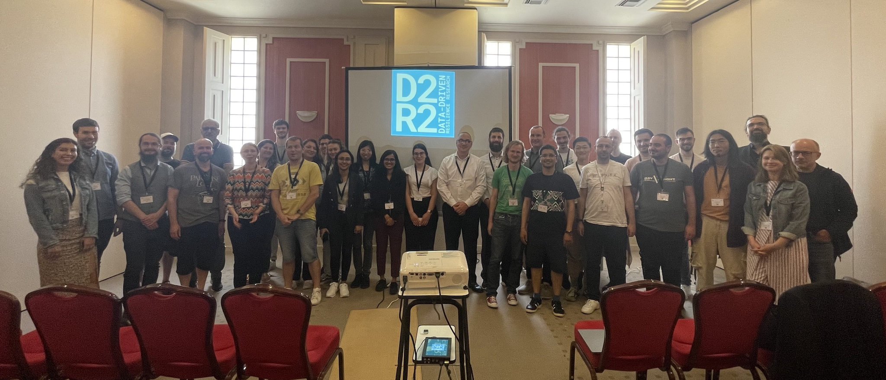

# D2R2’24: Third International Workshop on Linked Data-driven Resilience Research 2024 (2024-05-27)

## Latest News

!!! info "2024-03-28 - Submissions assigned to PC"

    We received 9 paper submissions to the workshop which are now assigned to the [members of program committee](program-committee.md) for review.

!!! info "2024-03-27 - Early Registration Rates"

    In order to attend the workshop, please [register to the ESWC2024](https://2024.eswc-conferences.org/registration/).
    You will get the early registration rates until 2024-04-24.

!!! info "2024-03-18 - Clarification of Page Limitations"

    Based on a question from a submitting researcher, we clarfied the submission page limits:
    Maximum 10 pages (full papers) or 5 pages (short papers, discussion papers).
    **This page count excludes references and appendices.**

!!! info "2024-02-27 - Deadline extension"

    We extended the deadline for workshop submissions to 2024-03-22.

!!! info "2024-02-13 - Date Fixed"

    The ESWC2024 workshops chairs just confirmed our workshop day via e-mail. The D2R2‘24 workshop will take place on 2024-05-27 (Monday).

!!! info "2023-12-12 - Workshop accepted"

    {align=right width=50%}
    The very active discussions at this years [D2R2'23](https://2023.d2r2.aksw.org/) demonstrated, that the research topic is still underrepresented so we decided to organize a third instantiation of the D2R2 workshop.

    We are now happy to anncounce, that the **Third International Workshop on Linked Data-driven Resilience Research 2024 (D2R2’24)** was accepted again as a half-day Workshop at the European Semantic Web Conference (ESWC2024).

    Please have a look at the [Call for Papers](call-for-papers.md) to get a overview on important dates.

## Abstract

In the face of continuously changing contextual conditions and ubiquitous disruptive crisis events, the concept of resilience refers to some of the most urgent, challenging, and interesting issues of nowadays society. 

Recent crises like the Covid-19 pandemic wave, the Russia-Ukraine War or the energy crisis have not only tested supply chains and economic value networks to their limits but revealed the need to increase flexibility of technical infrastructures, energy supply, health systems, and social textures alike. Currently, many economic and social spheres are continuously challenged by recession fear, political ploys, and weather disasters to unfold capacities to withstand as well as refine and transform themselves to stay ahead of changes.

Semantically represented data together with emerging technologies such as LLMs and agents can play a crucial role in increasing transparency of value chains and understanding the complex mechanisms of crisis factors on a global level. The systematic integration, KI-based modelling and analysis of huge amounts of data from various sources can build a new basis for situational awareness and decision making as well as for the elaboration of advanced resilience strategies.

The D2R2’24 workshop, which is again organised by the [CoyPu project](https://coypu.org/), will provide an open forum to exchange current issues, ideas, and trends in the area of Data-driven Resilience Research. The workshop will bring together scientists, software engineers, resilience practitioners, and domain experts in order to approach the topic from a multi-disciplinary perspective. Ongoing technological developments, current research approaches as well as use case scenarios, and field reports will be presented and discussed with a broad specialist audience. 

We invite contributions of novel results and ongoing work as well as position papers focusing on various aspects of Data-driven Resilience Research from a scientific or practical perspective.

